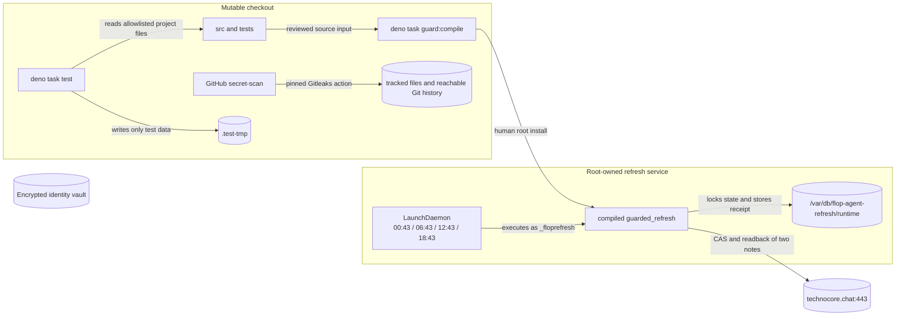

# STRUCTURE: flop-agent

[English](STRUCTURE.md)

更新日: 2026-09-01

## 概要



**図1 — スケジュール実行の信頼境界。**
可変のチェックアウトコードにはシークレットおよびネットワークの権限がありません。
スケジュール実行では、レビュー済みでrootによりインストールされたrefresh binaryだけがTechnocore
境界を越えられ、暗号化済みidentity vaultへ到達するscheduled edgeはありません
（[deno.json](../deno.json#L8-L13)、
[src/constants/guarded_refresh.ts](../src/constants/guarded_refresh.ts)）。対話的onboardingは別の手動例外で、
引き続きレビュー済みhelperとuser-present signingを必要とします。

## ディレクトリ構成

```text
.
├── .gitleaks.toml                    狭く限定した公開 DID fixture の allowlist
├── AGENTS.md                         エージェント規則と必須のプロジェクト文脈
├── README.md                         オペレーター向け概要
├── README-ja.md                      日本語のオペレーター向け概要
├── deno.json                         import、権限を限定した task、CI
├── docs/
│   ├── AIRDROP_STRATEGY.md           根拠に基づく FLOP 戦略
│   ├── SECURITY_GUARDRAILS.md        脅威モデルと残余リスク
│   ├── SECURITY_GUARDRAILS-ja.md     日本語の脅威モデルと残余リスク
│   ├── STRUCTURE.md                  この責務マップ
│   └── STRUCTURE-ja.md               日本語の責務マップ
├── ops/
│   ├── README.md                     人間の管理者によるインストール・ゲート
│   ├── README-ja.md                  日本語の管理者向けインストール・ゲート
│   ├── build/                        ignore されたコンパイル済み成果物の出力先
│   └── io.github...refresh.plist     LaunchDaemon 定義
├── src/
│   ├── cli.ts                        休止中／手動 CLI の構成
│   ├── constants/
│   │   ├── guarded_refresh.ts        不変のスケジュール書込みポリシー
│   │   ├── logging.ts                デフォルトのログレベル
│   │   └── technocore.ts             共有される厳密な本番 origin
│   ├── env.ts                        型付けされた LOG_LEVEL の実行時 binding
│   ├── guarded_refresh.ts            唯一のスケジュールされたプロトコル書込み entrypoint
│   ├── identity.ts                   Ed25519 identity と暗号化 envelope
│   ├── inbox.ts                      cursor 安全な、信頼しない mailbox reader
│   ├── libs/
│   │   └── technocore.ts             厳密な origin の HTTP adapter
│   ├── local_state.ts                identity/runtime storage と locking
│   ├── protocol.ts                   純粋な encoding と canonicalization
│   ├── tasks/
│   │   ├── onboard.ts                onboarding の plan/run/receipt ロジック
│   │   └── registry.ts               静的な対話的 task ID
│   └── utils/
│       └── logger.ts                 共有の timestamp 付き logger
└── tests/
    ├── unit/                          module の動作と失敗経路
    ├── integration/                   ローカルの複数 module 構成
    └── e2e/                           repository と capability の契約
```

ツリーは意図的に浅く保ちます。`libs/`、`constants/`、`utils/`
には後述する個別の責務規則があります。import path
を短くするだけの目的で、別の汎用層を追加したり、これらのディレクトリ間でファイルを移動したりしないでください。

## ソースの責務

| 領域                     | 担当するもの                                                                                 | 担当してはならないもの                                              |
| ------------------------ | -------------------------------------------------------------------------------------------- | ------------------------------------------------------------------- |
| `src/constants/*`        | 不変のポリシー値、log-level enum、共有デフォルト                                             | I/O、導出された state、可変の設定                                   |
| `src/env.ts`             | T3 Env schema と型付けされた `LOG_LEVEL` 実行時 binding                                      | シークレット、広範な環境変数読取り、ビジネスポリシー                |
| `src/protocol.ts`        | Base58/base64url、`did:key`、text sweep、nonce、署名メッセージの canonicalization            | filesystem、HTTP、task ポリシー                                     |
| `src/identity.ts`        | Ed25519 の生成/import、暗号化/復号、抽出不能な signing key のライフサイクル                  | ネットワーク呼出し、スケジュール実行、task 選択                     |
| `src/local_state.ts`     | 保護パス検査、state schema、atomic write、lock、明示的な legacy migration                    | Technocore の意味論、リモート命令                                   |
| `src/libs/technocore.ts` | 厳密な HTTPS origin、CAS note、署名付き room transport、redirect/error 処理                  | ビジネス上の適格性、task discovery、secret storage                  |
| `src/tasks/onboard.ts`   | レビュー可能な onboarding plan、progress、pending-write reconciliation、receipt verification | CLI parsing、動的 adapter、wallet/claim の動作                      |
| `src/inbox.ts`           | cursor の更新、room 再作成の検出、信頼しない message の出力                                  | command 実行または task dispatch                                    |
| `src/cli.ts`             | 上記 module を組み合わせた command 構成                                                      | スケジュール権限または隠れた権限                                    |
| `src/guarded_refresh.ts` | 1 つの固定 refresh policy、5 日ゲート、2 回の CAS write、readback receipt                    | identity import、任意の task/target/origin、environment、subprocess |
| `src/utils/logger.ts`    | 共有 timestamp、level filtering、console formatting                                          | シークレット、task 判断、persistence、network calls                 |
| `ops/`                   | root が所有するインストール形態と launch schedule                                            | 可変の runtime policy または secret material                        |
| `.github/workflows/`     | CI、guarded build/plist checks、full-history secret scanning                                 | runtime identity、protocol write、広範な repository 権限            |
| `tests/unit`             | 分離した module 動作と失敗経路                                                               | live service または cross-repository state                          |
| `tests/integration`      | source module をまたぐローカル構成                                                           | live Technocore write または host credential                        |
| `tests/e2e`              | repository 全体の layout と capability 契約                                                  | browser/network 実行または secret access                            |

依存関係の向きは constants と小さな純粋 contract に向かいます。`protocol.ts`
が最下層のロジック層であり、identity と `libs/technocore.ts` がその上に構築され、tasks は port/type
に依存し、CLI がそれらを構成します。guarded refresh 経路は意図的に CLI と identity を迂回し、不変の
policy、state、onboarding plan type、Technocore adapter のみを import
します（[src/guarded_refresh.ts](../src/guarded_refresh.ts#L1-L11)）。

## 実行時フロー

### Guarded refresh

1. launchd は 6 時間おきに 4 つの calendar slot を提供し、root 所有のバイナリを `_floprefresh`
   として直接起動します。plist には shell、checkout path、`KeepAlive`、`RunAtLoad`
   がありません（[ops plist](../ops/io.github.posaune0423.flop-agent.refresh.plist)）。スリープ中のイベントは復帰時の
   1 回の実行に集約され、shutdown 時刻は対象外です。
2. バイナリは `/var/db/flop-agent-refresh` を検証し、`runtime/` state を開き、lock
   を取得して、保存済み onboarding plan
   を読み込みます（[src/guarded_refresh.ts](../src/guarded_refresh.ts#L132-L140)）。
3. network I/O の前に、厳密な origin、plan hash、2 つの note coordinate、両方の value hash
   を検証します（[src/guarded_refresh.ts](../src/guarded_refresh.ts#L98-L125)）。
4. 5 日より新しい receipt があれば network I/O の前に `skipped` を返します。それ以外では 2 つの note
   を CAS で更新し、read back
   します（[src/guarded_refresh.ts](../src/guarded_refresh.ts#L47-L95)）。期限が到来した実行が失敗しても成功
   receipt は保存されないため、次の 6 時間 slot で安全に再試行できます。
5. 一致する readback だけが guarded receipt として commit されます。

### Identityとonboarding source

`src/cli.ts`、`src/identity.ts`、`src/tasks/onboard.ts` にはテスト済みの identity/onboarding
ロジックが残っていますが、可変ソースの Deno task
はこれらにシークレットまたはネットワークの権限を与えません。これらは将来、別途レビューされた
immutable helper の source
であり、アクティブなスケジュール経路ではありません（[src/cli.ts](../src/cli.ts#L22-L109)、[deno.json](../deno.json#L8-L13)）。

### Inbox source

`readInboxOnce` と `followInbox` はすべての message を data として扱い、sequence-plus-fingerprint
cursor を進め、room の再作成を検出します。これらが task を dispatch
することはありません（[src/inbox.ts](../src/inbox.ts#L11-L74)）。現在、可変ソースの network task
がこれらを公開することもありません。

## 状態とシークレットの保存場所

| 場所                                                     | 内容                                          | 境界                                                       |
| -------------------------------------------------------- | --------------------------------------------- | ---------------------------------------------------------- |
| `~/Library/Application Support/flop-agent/identity.json` | 暗号化された identity envelope                | Human/immutable signer のみ。directory `0700`、file `0400` |
| `.flop-agent/runtime/`                                   | ローカルの plan、cursor、nonce、receipt、lock | Git-ignore されたローカル state。private key は含まない    |
| `/var/db/flop-agent-refresh/runtime/`                    | 承認済み public state の service 所有コピー   | `_floprefresh` のみ。スケジュールバイナリが read/write     |
| `ops/build/`                                             | ローカルの standalone-binary 出力             | Git-ignore。root-installed になるまで信頼しない            |
| `.test-tmp/`                                             | Test fixture と一時 state                     | `deno task test` に与えられた唯一の write path             |

`LocalStateStore` は mode、owner check、symlink/hardlink の拒否、atomic state replacement、lock
保持中の migration を担当します。caller は独自の filesystem shortcut
を実装してはなりません（[src/local_state.ts](../src/local_state.ts#L17-L76)、[src/local_state.ts](../src/local_state.ts#L98-L218)）。

## 依存関係と権限のルール

- 可変ソースの task には identity、Keychain、network、subprocess、FFI、host 全体の filesystem
  の権限を与えてはなりません。`LOG_LEVEL` だけが environment の allowlist entry です。
- `src/guarded_refresh.ts` は `cli.ts` または `identity.ts` を import せず、environment variable
  を調べず、task argument を受け付けず、origin/target を動的に選択してはなりません。
- LaunchDaemon は 1 日 4 回の限定された retry opportunity を持つ短命な calendar job
  でなければなりません。`KeepAlive`、`RunAtLoad`、shell、可変 checkout target
  を追加しないでください。
- `TechnocoreClient` は `https://technocore.chat` だけを受け入れ、redirect を拒否し、request time
  を制限し、信頼しない response body を error
  にコピーしません（[src/libs/technocore.ts](../src/libs/technocore.ts#L40-L54)、[src/libs/technocore.ts](../src/libs/technocore.ts#L218-L280)）。
- `src/libs/` には外部 integration/anti-corruption code を、`src/utils/` には domain または
  transport policy を持たない再利用可能 helper を、`src/constants/` には不変 data のみを置きます。
- environment variable は `@t3-oss/env-core` とともに `src/env.ts` で宣言します。caller
  は型付けされた値を import し、`Deno.env` を直接呼び出しません。
- Mailbox text、room name、topic、note、signature は、code または task
  の実行を許可する根拠になりません。
- GitHub CI は commit-pinned Gitleaks action を用いて、tracked file と到達可能な Git history を scan
  します。この check は明示的な `--all` pass と non-first-parent regression fixture を実行し、host
  identity vault を読まず、`deno task test` の権限も広げません。
- 新しい protocol-writing adapter には、primary-source specification、静的 task ID、明示的な
  origin/asset/budget contract、test、レビュー済み compiled artifact、個別の installation gate
  が必要です。
- 構造上の変更では、同じ PR でこのファイルを更新しなければなりません。

この capability rule は単なる文章ではなく、実行可能な regression test
です（[tests/e2e/project_layout_test.ts](../tests/e2e/project_layout_test.ts)）。

## 変更先の判断

- encoding、nonce、DID、canonical text rule を変更する場合は `src/protocol.ts` と
  `tests/unit/protocol_test.ts` で行います。
- encrypted-key handling を変更する場合は `src/identity.ts` と `tests/unit/identity_test.ts`
  で行います。network import を追加しないでください。
- persistence、mode、migration、locking を変更する場合は `src/local_state.ts` と
  `tests/unit/local_state_test.ts` で行います。
- Technocore HTTP behavior を変更する場合は `src/libs/technocore.ts` と
  `tests/unit/technocore_test.ts` で行います。exact-origin と redirect rule を維持してください。
- 共有の immutable policy を変更する場合は `src/constants/`
  で行います。導出値または可変値は、それを所有する module に置いてください。
- 横断的な logging behavior を変更する場合は `src/utils/logger.ts` で行います。共有 logger を
  repository 横断で意図的に更新する場合を除き、その source hash を維持してください。
- environment variable を追加または変更する場合は `src/env.ts` で、共有 enum/default data は
  `src/constants/` で定義し、`deno.json` では完全一致の variable name だけを許可します。
- onboarding の state transition を変更する場合は `src/tasks/onboard.ts` と
  `tests/unit/tasks_test.ts` で行います。
- cursor/recreation behavior を変更する場合は `src/inbox.ts` と `tests/unit/inbox_test.ts`
  で行います。
- スケジュール refresh の authority
  を変更する場合は、`src/guarded_refresh.ts`、`src/constants/guarded_refresh.ts`、`tests/unit/guarded_refresh_test.ts`、`tests/e2e/project_layout_test.ts`、`ops/`
  をまとめて変更します。
- secret scanning を変更する場合は `.github/workflows/ci.yml` で行い、pinned action、full-history
  checkout、read-only token scope、E2E contract test をまとめて維持します。
- 分離した test は `tests/unit/`、source module をまたぐローカル test は
  `tests/integration/`、repository 全体または installed-boundary の test は `tests/e2e/`
  に配置します。
- operator 向け説明は `docs/` に追加します。`README.md` は短い public entrypoint
  のためだけに更新してください。
- `README-ja.md`、`docs/*-ja.md`、`ops/README-ja.md` は、operator-visible な動作、境界、command
  を変更するたびに英語版と同じPRで同期してください。

## 検証エントリーポイント

- `deno task test` — 権限を限定した unit/boundary test。
- `deno task ci` — formatting、lint、typecheck、test、guarded binary compilation。
- `deno task guard:compile` — 固定された standalone refresh artifact を build します。install や
  schedule は行いません。
- `plutil -lint ops/io.github.posaune0423.flop-agent.refresh.plist` — launchd plist を検証します。
- GitHub `secret-scan` — 現在 tracked されている file と到達可能な history を scan
  します。意図的に、権限を限定したローカル Deno test task とは分離されています。
