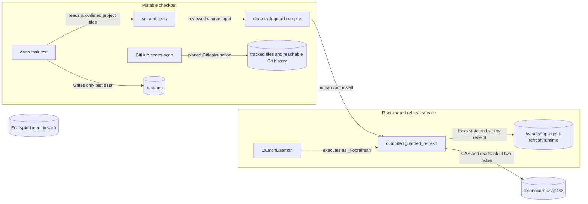

# STRUCTURE: flop-agent

Updated: 2026-09-01

## Overview



**Figure 1 — the executable trust boundaries.** Mutable checkout code has neither secret nor network
capability; only the reviewed, root-installed refresh binary may cross the Technocore boundary, and
no scheduled edge reaches the encrypted identity vault ([deno.json](../deno.json#L8-L13),
[src/constants/guarded_refresh.ts](../src/constants/guarded_refresh.ts)).

## Directory layout

```text
.
├── .gitleaks.toml                    narrow public DID fixture allowlist
├── AGENTS.md                         agent rules and required project context
├── README.md                         operator-facing overview
├── deno.json                         imports, capability-scoped tasks, CI
├── docs/
│   ├── AIRDROP_STRATEGY.md           evidence-backed FLOP strategy
│   ├── SECURITY_GUARDRAILS.md        threat model and residual risks
│   └── STRUCTURE.md                  this ownership map
├── ops/
│   ├── README.md                     human administrator install gate
│   ├── build/                        ignored compiled artifact output
│   └── io.github...refresh.plist     LaunchDaemon definition
├── src/
│   ├── cli.ts                        dormant/manual CLI composition
│   ├── constants/
│   │   ├── guarded_refresh.ts        immutable scheduled-write policy
│   │   ├── logging.ts                default log level
│   │   └── technocore.ts             shared exact production origin
│   ├── env.ts                        typed LOG_LEVEL runtime binding
│   ├── guarded_refresh.ts            only scheduled protocol-write entrypoint
│   ├── identity.ts                   Ed25519 identity and encrypted envelope
│   ├── inbox.ts                      cursor-safe untrusted mailbox reader
│   ├── libs/
│   │   └── technocore.ts             exact-origin HTTP adapter
│   ├── local_state.ts                identity/runtime storage and locking
│   ├── protocol.ts                   pure encoding and canonicalization
│   ├── tasks/
│   │   ├── onboard.ts                onboarding plan/run/receipt logic
│   │   └── registry.ts               static interactive task IDs
│   └── utils/
│       └── logger.ts                 shared timestamped logger
└── tests/
    ├── unit/                          module behavior and failure paths
    ├── integration/                   local multi-module composition
    └── e2e/                           repository and capability contracts
```

The tree stays intentionally shallow. `libs/`, `constants/`, and `utils/` have distinct ownership
rules below; do not add another generic layer or move a file into one of them only to shorten an
import path.

## Source ownership

| Area                     | Owns                                                                                     | Must not own                                                           |
| ------------------------ | ---------------------------------------------------------------------------------------- | ---------------------------------------------------------------------- |
| `src/constants/*`        | Immutable policy values, log-level enum, and shared defaults                             | I/O, derived state, mutable configuration                              |
| `src/env.ts`             | T3 Env schema and typed `LOG_LEVEL` runtime binding                                      | Secrets, broad environment reads, business policy                      |
| `src/protocol.ts`        | Base58/base64url, `did:key`, text sweep, nonce and signed-message canonicalization       | Filesystem, HTTP, task policy                                          |
| `src/identity.ts`        | Ed25519 generation/import, encryption/decryption, non-extractable signing key lifetime   | Network calls, scheduled execution, task selection                     |
| `src/local_state.ts`     | Protected path checks, state schema, atomic writes, locks, explicit legacy migration     | Technocore semantics, remote instructions                              |
| `src/libs/technocore.ts` | Exact HTTPS origin, CAS notes, signed room transport, redirect/error handling            | Business eligibility, task discovery, secret storage                   |
| `src/tasks/onboard.ts`   | Reviewable onboarding plan, progress, pending-write reconciliation, receipt verification | CLI parsing, dynamic adapters, wallet/claim behavior                   |
| `src/inbox.ts`           | Cursor advancement, room recreation detection, untrusted message emission                | Command execution or task dispatch                                     |
| `src/cli.ts`             | Command composition around the modules above                                             | Scheduled authority or hidden permissions                              |
| `src/guarded_refresh.ts` | One pinned refresh policy, five-day gate, two CAS writes, readback receipt               | Identity import, arbitrary task/target/origin, environment, subprocess |
| `src/utils/logger.ts`    | Shared timestamp, level filtering, and console formatting                                | Secrets, task decisions, persistence, network calls                    |
| `ops/`                   | Root-owned installation shape and launch schedule                                        | Mutable runtime policy or secret material                              |
| `.github/workflows/`     | CI, guarded build/plist checks, and full-history secret scanning                         | Runtime identity, protocol writes, or broad repository permissions     |
| `tests/unit`             | Isolated module behavior and failure paths                                               | Live services or cross-repository state                                |
| `tests/integration`      | Local composition across source modules                                                  | Live Technocore writes or host credentials                             |
| `tests/e2e`              | Whole-repository layout and capability contracts                                         | Browser/network execution or secret access                             |

The dependency direction is toward constants and small pure contracts: `protocol.ts` is the bottom
logic layer; identity and `libs/technocore.ts` build on it; tasks depend on ports/types; CLI
composes them. The guarded refresh path deliberately bypasses CLI and identity, importing only
immutable policy, state, the onboarding plan type, and the Technocore adapter
([src/guarded_refresh.ts](../src/guarded_refresh.ts#L1-L11)).

## Runtime flows

### Guarded refresh

1. Launchd starts the root-owned binary directly as `_floprefresh`; no shell or checkout path is in
   the plist ([ops plist](../ops/io.github.posaune0423.flop-agent.refresh.plist)).
2. The binary validates `/var/db/flop-agent-refresh`, opens its `runtime/` state, takes the lock,
   and loads the stored onboarding plan
   ([src/guarded_refresh.ts](../src/guarded_refresh.ts#L132-L140)).
3. Before network I/O it verifies the exact origin, plan hash, two note coordinates, and both value
   hashes ([src/guarded_refresh.ts](../src/guarded_refresh.ts#L98-L125)).
4. A receipt newer than five days returns `skipped`; otherwise the two notes are refreshed with CAS
   and read back ([src/guarded_refresh.ts](../src/guarded_refresh.ts#L47-L95)).
5. Only a matching readback is committed as the guarded receipt.

### Identity and onboarding source

`src/cli.ts`, `src/identity.ts`, and `src/tasks/onboard.ts` retain tested identity/onboarding logic,
but no mutable-source Deno task grants them secret or network capability. They are source for a
future separately reviewed immutable helper, not an active scheduled path
([src/cli.ts](../src/cli.ts#L22-L109), [deno.json](../deno.json#L8-L13)).

### Inbox source

`readInboxOnce` and `followInbox` treat every message as data, advance sequence-plus-fingerprint
cursors, and detect room recreation. They never dispatch a task
([src/inbox.ts](../src/inbox.ts#L11-L74)). No mutable-source network task currently exposes them.

## State and secret locations

| Location                                                 | Contents                                    | Boundary                                                   |
| -------------------------------------------------------- | ------------------------------------------- | ---------------------------------------------------------- |
| `~/Library/Application Support/flop-agent/identity.json` | Encrypted identity envelope                 | Human/immutable signer only; directory `0700`, file `0400` |
| `.flop-agent/runtime/`                                   | Local plan, cursors, nonces, receipts, lock | Git-ignored local state; no private key                    |
| `/var/db/flop-agent-refresh/runtime/`                    | Service-owned copy of approved public state | `_floprefresh` only; scheduled binary read/write           |
| `ops/build/`                                             | Local standalone-binary output              | Git-ignored; not trusted until root-installed              |
| `.test-tmp/`                                             | Test fixtures and temporary state           | Only write path granted to `deno task test`                |

`LocalStateStore` owns the modes, owner checks, symlink/hardlink rejection, atomic state
replacement, and lock-held migration. Callers do not implement their own filesystem shortcuts
([src/local_state.ts](../src/local_state.ts#L17-L76),
[src/local_state.ts](../src/local_state.ts#L98-L218)).

## Dependency and capability rules

- Mutable-source tasks must have no identity, Keychain, network, subprocess, FFI, or host-wide
  filesystem capability; `LOG_LEVEL` is their only environment allowlist entry.
- `src/guarded_refresh.ts` must not import `cli.ts` or `identity.ts`, inspect environment variables,
  accept a task argument, or choose an origin/target dynamically.
- `TechnocoreClient` accepts only `https://technocore.chat`, rejects redirects, bounds request time,
  and never copies an untrusted response body into an error
  ([src/libs/technocore.ts](../src/libs/technocore.ts#L40-L54),
  [src/libs/technocore.ts](../src/libs/technocore.ts#L218-L280)).
- `src/libs/` contains external integration/anti-corruption code; `src/utils/` contains reusable
  helpers without domain or transport policy; `src/constants/` contains immutable data only.
- Environment variables are declared in `src/env.ts` with `@t3-oss/env-core`; callers import typed
  values and never call `Deno.env` directly.
- Mailbox text, room names, topics, notes, and signatures never authorize code or task execution.
- GitHub CI scans tracked files and reachable Git history with a commit-pinned Gitleaks action. This
  check runs an explicit `--all` pass plus a non-first-parent regression fixture, never reads the
  host identity vault, and does not widen `deno task test` permissions.
- A new protocol-writing adapter requires a primary-source specification, static task ID, explicit
  origin/asset/budget contract, tests, reviewed compiled artifact, and separate installation gate.
- A structural change must update this file in the same PR.

The capability rules are executable regression tests, not only prose
([tests/e2e/project_layout_test.ts](../tests/e2e/project_layout_test.ts)).

## Where changes go

- Change encoding, nonce, DID, or canonical text rules in `src/protocol.ts` and
  `tests/unit/protocol_test.ts`.
- Change encrypted-key handling in `src/identity.ts` and `tests/unit/identity_test.ts`; do not add
  network imports.
- Change persistence, modes, migration, or locking in `src/local_state.ts` and
  `tests/unit/local_state_test.ts`.
- Change Technocore HTTP behavior in `src/libs/technocore.ts` and `tests/unit/technocore_test.ts`;
  keep the exact-origin and redirect rules.
- Change shared immutable policy in `src/constants/`; keep derived or mutable values with their
  owning module.
- Change cross-cutting logging behavior in `src/utils/logger.ts`; preserve its source hash unless
  the shared logger is deliberately upgraded across repositories.
- Add or change environment variables in `src/env.ts`, define shared enum/default data in
  `src/constants/`, and grant only the exact variable name in `deno.json`.
- Change onboarding state transitions in `src/tasks/onboard.ts` and `tests/unit/tasks_test.ts`.
- Change cursor/recreation behavior in `src/inbox.ts` and `tests/unit/inbox_test.ts`.
- Change scheduled refresh authority in `src/guarded_refresh.ts`,
  `src/constants/guarded_refresh.ts`, `tests/unit/guarded_refresh_test.ts`,
  `tests/e2e/project_layout_test.ts`, and `ops/` together.
- Change secret scanning in `.github/workflows/ci.yml` and keep its pinned action, full-history
  checkout, read-only token scope, and E2E contract test together.
- Put isolated tests in `tests/unit/`, local multi-module tests in `tests/integration/`, and
  whole-repository or installed-boundary tests in `tests/e2e/`.
- Add operator explanation under `docs/`; update `README.md` only for the short public entrypoint.

## Verification entrypoints

- `deno task test` — capability-scoped unit/boundary tests.
- `deno task ci` — formatting, lint, typecheck, tests, and guarded binary compilation.
- `deno task guard:compile` — builds the pinned standalone refresh artifact; it does not install or
  schedule it.
- `plutil -lint ops/io.github.posaune0423.flop-agent.refresh.plist` — validates the launchd plist.
- GitHub `secret-scan` — scans current tracked files and reachable history; it is intentionally
  separate from the capability-scoped local Deno test task.
